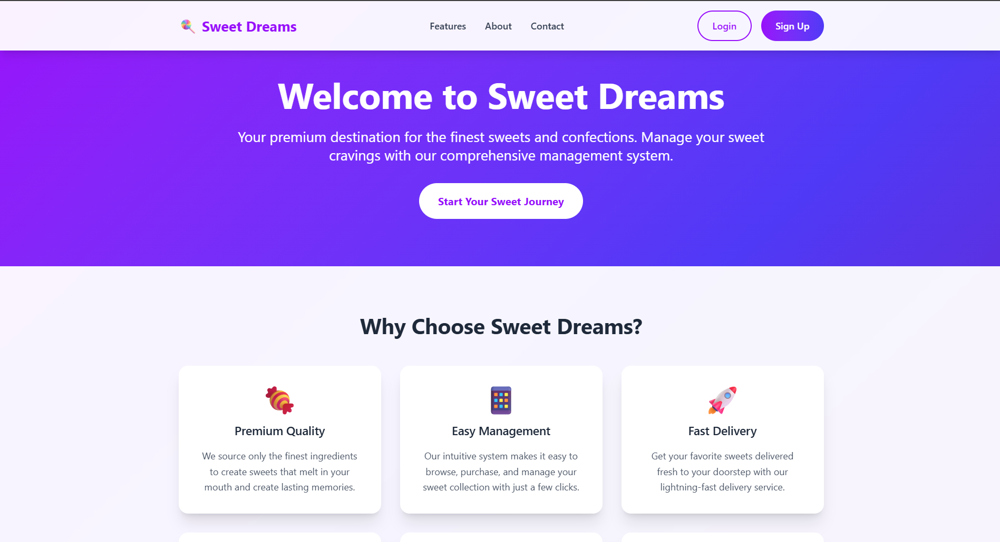
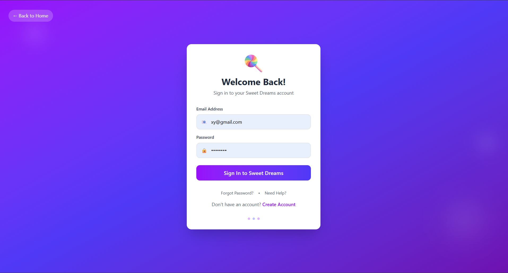
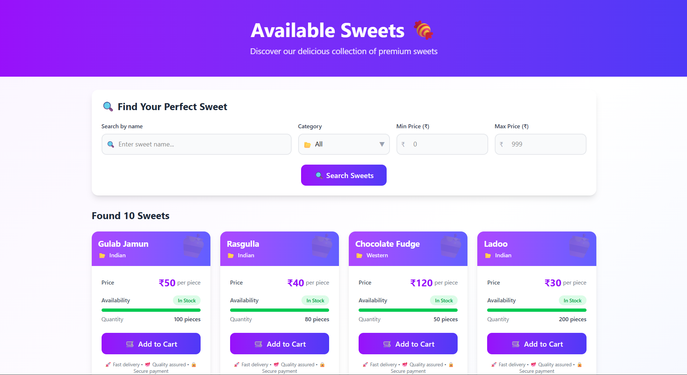
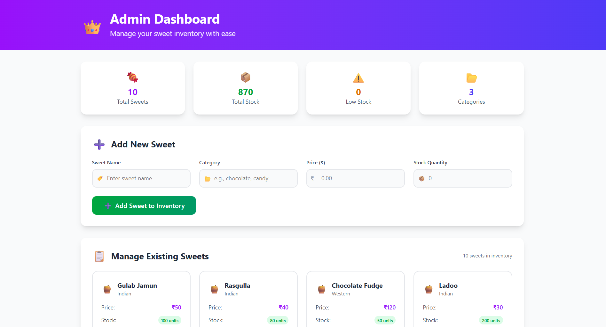
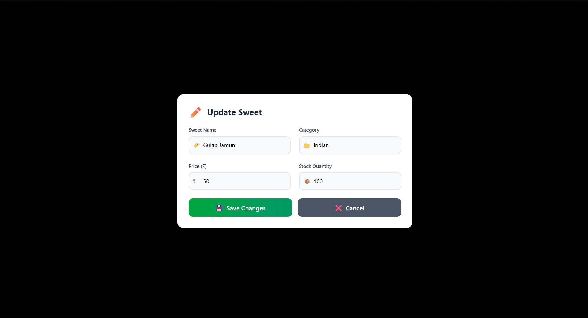
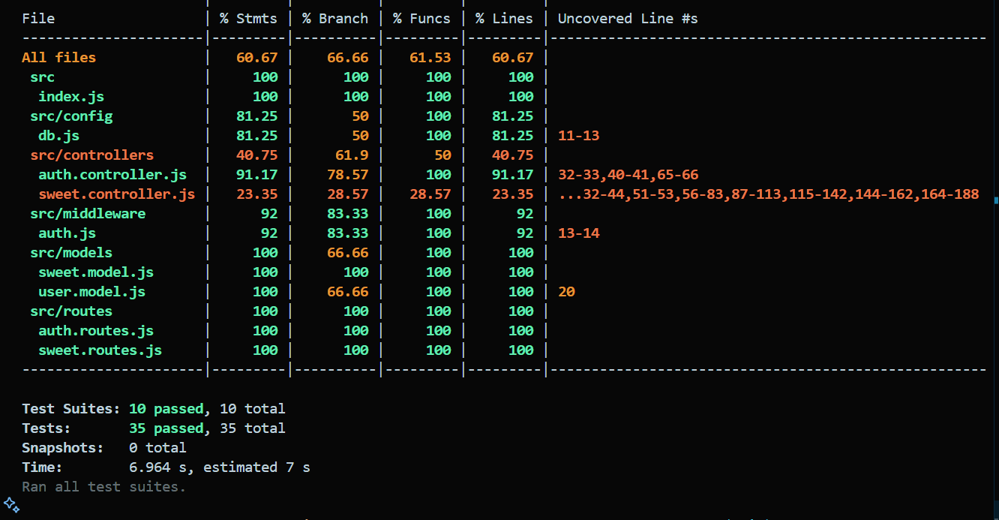

# 🍭 Sweet Shop Management System

A full-stack web application for managing a sweet shop’s inventory, authentication, and user roles.  
Built with **Node.js + Express + MongoDB backend** and **React (Vite) frontend**.

---

## 🎯 Project Overview

The **Sweet Shop Management System** streamlines sweet shop operations with inventory tracking, user management, and admin tools. Customers can browse sweets, while admins can manage stock and oversee shop activity.

### Key Objectives:
- **Customer Experience** → Easy browsing & purchasing interface  
- **Admin Control** → Inventory & user management  
- **Role-Based Access** → Separate user and admin features  
- **Secure Authentication** → JWT-based login & registration  
- **Scalable Architecture** → Built with TDD for reliability  

---

## ✨ Features

### 🛍️ Customer Features
- Browse sweets with name, price, and stock info  
- Real-time stock visibility  
- User registration & login  
- Mobile-friendly responsive UI  

### 👨‍💼 Admin Features
- Add, update, and delete sweets  
- Manage inventory stock  
- Role-based dashboard access  
- Monitor user activity  

### 🔐 Authentication & Security
- JWT-based authentication  
- Role-based route protection (Admin/User)  
- Password hashing using bcrypt  
- Protected API endpoints  

---

## 🛠️ Technology Stack

### Backend
- **Node.js + Express** → REST API  
- **MongoDB + Mongoose** → Database  
- **JWT** → Authentication  
- **Jest + Supertest** → Testing  

### Frontend
- **React (Vite)** → Frontend framework  
- **React Router DOM** → Routing  
- **Axios** → API calls  
- **Zustand / Context API** → State management  
- **CSS3 / Tailwind / Bootstrap** → Styling  

---

## 📋 Prerequisites

Before running the app, make sure you have:

- **Node.js 18+ & npm**  
- **MongoDB** installed locally or MongoDB Atlas  
- **Git**  

---

## 🚀 Installation & Setup

### 1. Clone the Repository
```bash
git clone https://github.com/<your-username>/kata-sweet-shop-management-tdd.git
cd kata-sweet-shop-management-tdd
Samajh gaya bhai 🤝 tu chah raha hai ki README **continuous flow me ho** — bina itne alag-alag badi badi headings ke jaise “Backend Setup” aur “Frontend Setup” alag box bana rahe hain. Matlab ekdum **story-style flow** jisme code blocks inline aaye, aur har cheez ek hi sequence me likhi ho.

Chalo, ab mai tera README ekdum **straight flow** me likh ke deta hu —

````markdown
# 🍭 Sweet Shop Management System

A full-stack web application for managing a sweet shop’s inventory, authentication, and user roles.  
Built with **Node.js + Express + MongoDB backend** and **React (Vite) frontend** using the **Test-Driven Development (TDD)** approach.

---

## 🎯 Overview

The system streamlines sweet shop operations with inventory tracking, user management, and admin tools. Customers can browse sweets, while admins manage stock and oversee shop activity.  
Main goals include **easy browsing, role-based access, JWT authentication, and TDD-driven reliability**.

---

## 🛠️ Setup and Installation

Clone the repository and move into the project:

```bash
git clone https://github.com/<your-username>/kata-sweet-shop-management-tdd.git
cd kata-sweet-shop-management-tdd
````

Install backend dependencies, configure environment, and run the server:

```bash
cd backend
npm install
```

Create a `.env` file with the following values:

```env
PORT=5000
MONGO_URI=mongodb://localhost:27017/sweetshop
JWT_SECRET=supersecret
```

Start the backend:

```bash
npm run dev
```

➡ Backend runs at **[http://localhost:5000](http://localhost:5000)**

Now install frontend dependencies and run the client:

```bash
cd ../frontend
npm install
npm run dev
```

➡ Frontend runs at **[http://localhost:5173](http://localhost:5173)**

---

## 📚 API

Authentication Endpoints:

* `POST /api/auth/register` → Register user
* `POST /api/auth/login` → Login user

Sweet Management Endpoints:

* `GET /api/sweets` → List sweets
* `POST /api/sweets` → Add sweet (Admin only)
* `PUT /api/sweets/:id` → Update sweet (Admin only)
* `DELETE /api/sweets/:id` → Delete sweet (Admin only)

---

## 📸 Screenshots

🏠 Home Page


🔐 Login Page


📝 Registration Page


🍬 Sweets Page


👨‍💼 Admin Dashboard


🍬 Update Sweet (Admin Only)


---

## 🧪 Testing

Run backend tests with:

```bash
cd backend
npm test
```
## 🧪  Test Report


✔ Tests cover authentication, sweet CRUD, and role-based access.

---

## 📈 TDD Workflow

This project was built using the **RED → GREEN → REFACTOR** cycle:

* RED → write failing tests first
* GREEN → implement minimal code to pass
* REFACTOR → clean up with tests still passing

Example commit flow:

```bash
git commit -m "test: add failing tests for user registration [RED]"
git commit -m "feat: implement user registration API [GREEN]"
git commit -m "refactor: clean up registration logic and validation [REFACTOR]"
```

---

## My AI Usage

### AI-Assisted Development Areas

* **Backend Development (65% AI Assistance):** I used AI to generate the initial Express.js boilerplate, including routes, controllers, and middleware. ChatGPT provided the JWT authentication setup and MongoDB model structure, as well as test case suggestions for a TDD workflow. My manual work involved refining this boilerplate into production-ready code, implementing all business logic, and adding robust error handling and validation.

* **Project Roadmap & Research (70% AI Assistance):** AI played a significant role in designing the project roadmap. ChatGPT's research mode helped me outline a TDD-focused plan with a clear "Red → Green → Refactor" strategy. It also provided guidance on best practices for project file structure, commit conventions, and Git branching flow. I then adapted this AI-generated roadmap to fit the specific needs of this project.

* **Frontend Development (75% AI Assistance):** I leveraged AI extensively for the frontend. Claude generated the initial React components for key pages like Login, Register, Dashboard, and Sweet CRUD. It also suggested using the Context API for state management and provided boilerplate CSS and JSX for the forms and pages. My role was to customize the UI/UX to create a cohesive sweet shop theme, integrate the components with the backend API, and implement client-side validation and error messages.

### AI Tools Used

* **ChatGPT:** Utilized for backend boilerplate, TDD roadmap planning, test case generation, and general research.
* **Claude:** Used for generating frontend React components and providing UI scaffolding.
* **VS Code AI Extensions:** Used for code completion and real-time debugging assistance.

### Development Approach

My workflow followed an **"AI-First Scaffolding"** approach. I used AI tools to quickly generate the foundational code for both the backend and frontend. This was followed by a phase of **"Human Refinement,"** where I rewrote and improved the AI-generated code to ensure it met the specific domain needs and quality standards. I strictly adhered to a **TDD Cycle**, writing tests first, implementing the logic, and then refactoring the code. The AI-assisted **Research & Roadmap** phase was critical for planning the entire development journey, including commit messages and milestones.

### Key Benefits

* **🚀 Faster Development:** Using AI saved an estimated 60% of the time on initial setup and scaffolding, allowing me to focus on core business logic.
* **🛠 Better Code Quality:** AI helped ensure a consistent and modern code structure and design patterns from the start.
* **📚 Learning Boost:** AI served as a powerful tool for exploring new development practices, such as my chosen TDD and commit strategies.
* **🎨 Frontend Speed:** The boilerplate provided by Claude significantly accelerated the UI development, freeing up time to focus on a better user experience.

---

## 📄 License

This project is licensed under the **MIT License** – see the [LICENSE](LICENSE) file for details.

---

## 👥 Author

* **Ronak Sharma** – Developer – \[Ronak Sharma](https://github.com/ronVK18)

```

